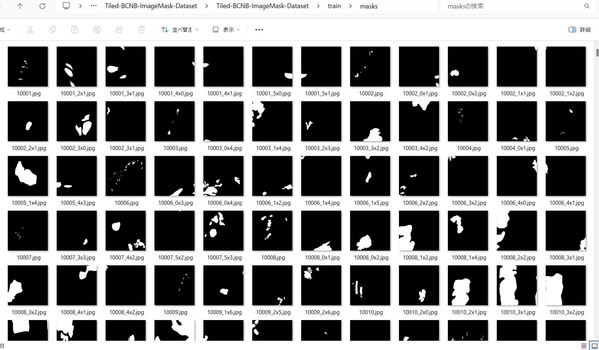

<h2>Tiled-ImageMask-Dataset-BCNB (Updated: 2024/08/25)</h2>
<li>2024/08/24: Fixed a bug in ImageMaskDatasegGenerator.py</li>
<li>2024/08/24: Modified ImageMaskDatasegGenerator.py to be able to take a command line parameter to specify a shrink_ratio. 
<li>2024/08/25: Uploaded Enhanced Version <a href="https://drive.google.com/file/d/1h5c1UeHNZmcqfvnym9bxmDhtYaao94G8/view?usp=sharing">
Tiled-BCNB-ImageMask-Dataset-V2.zip</a> to the google drive . 

</li>
 
This is Tiled-ImageMask Dataset for BCNB (Breast Cancer Core-Needle Biopsy WSI) . 
The dataset used here has been taken from the web-site <a href="https://bcnb.grand-challenge.org/Dataset/">BCNB Dataset</a>
  

<b>Download Tiled-ImageMask-Dataset</b> 
You can download our datasets from the google drive: 
<b>1. Basic Version (shrink_ratio=0.1):</b>  
<a href="https://drive.google.com/file/d/1yHPYPiSIRPgs36iAu8TwLOA0gRO_VLhC/view?usp=sharing">
Tiled-BCNB-ImageMask-Dataset.zip</a>
 
 

 

<b>2. Enhanced Version (shrink_ratio=0.2)</b> 

<a href="https://drive.google.com/file/d/1h5c1UeHNZmcqfvnym9bxmDhtYaao94G8/view?usp=sharing">
Tiled-BCNB-ImageMask-Dataset-V2.zip</a>
 
 

 

 
<h3>1. Dataset Citation</h3>
The original dataset used here was taken from the following web-site 
<a href="https://bcnb.grand-challenge.org/Dataset/">Early Breast Cancer Core-Needle Biopsy WSI (BCNB) </a>
 
 
<b>BCNB Dataset</b> 
The dataset of Early Breast Cancer Core-Needle Biopsy WSI (BCNB) includes core-needle biopsy whole slide images (WSIs) 
of early breast cancer patients and the corresponding clinical data.
<a href="https://www.frontiersin.org/journals/oncology/articles/10.3389/fonc.2021.759007/full">
<b>
Predicting Axillary Lymph Node Metastasis in Early Breast Cancer Using Deep Learning on Primary Tumor Biopsy Slides
</b>
</a>.

<b>
Please note that the dataset is only used for education and research, and the usage for commercial and clinical applications is not allowed.
</b> 
  
<b>Annotation</b> 
Annotation information is stored in .json with the following format, where "vertices" 
have recorded coordinates of each point in the polygonal annotated area.
 
 

<b>License</b> 
This dataset is made freely available to academic and non-academic entities for non-commercial purposes such as academic research, teaching, scientific publications, or personal experimentation. Permission is granted to use the data given that you agree to our license terms bellow:

That you include a reference to the dataset in any work that makes use of the dataset. For research papers, cite our preferred publication as listed on our website; for other media cite our preferred publication as listed on our website or link to the website.
That you do not distribute this dataset or modified versions. It is permissible to distribute derivative works in as far as they are abstract representations of this dataset (such as models trained on it or additional annotations that do not directly include any of our data).
That you may not use the dataset or any derivative work for commercial purposes as, for example, licensing or selling the data, or using the data with a purpose to procure a commercial gain.
That all rights not expressly granted to you are reserved by us.
 
 
@article{xu2021predicting,
title={Predicting Axillary Lymph Node Metastasis in Early Breast Cancer Using Deep Learning on Primary Tumor Biopsy Slides},
author={Xu, Feng and Zhu, Chuang and Tang, Wenqi and Wang, Ying and Zhang, Yu and Li, Jie and Jiang, Hongchuan and Shi, Zhongyue and Liu, Jun and Jin, Mulan},
journal={Frontiers in Oncology},
pages={4133},
year={2021},
publisher={Frontiers}
}
 
 

<h3>2. Create master dataset</h3>
Please visit the Dataset Page; 
<a href="https://bupt-ai-cz.github.io/BCNB/">https://bupt-ai-cz.github.io/BCNB/</a>
 and download WSIs, which contains 1058 jpg image files and json annotatioin files. 

<pre>
./WSIs
├─1.jpg
├─1.json
├─2.jpg
├─2.json
...
├─1058.jpg
└─1058.json
</pre>
<b>Json annotation file</b> 

  

Please run the following command for Python script <a href="./ImageMaskDatasetGenerator.py">
ImageMaskDatasetGenerator.py
</a> 
<pre>
python ImageMaskDatasetGenerator.py
</pre>
If you would like to specify a shrink_ratio on the command line, please run the command as shown below. 
<pre>
python ImageMaskDatasetGenerator.py 0.2
</pre>
No such parameter given, the default shrink_ratio is 0.1, namely one tenth shrinking.
This command generates one tenth size of image and mask files from the large original WSI jpg files and json annotation files.
All mask jpg files were generated by drawing white filled polygons of (x,y) 2d-array in <b>vertices</b> of all <b>positive</b> data of the json files. 
<pre>
./BCNB-master
├─images
│  ├─10001.jpg
...
│  └─11058.jpg
└─masks
    ├─10001.jpg
...    
    └─11058.jpg
</pre>

 

<b>BCNB-master images</b> 
  
<b>BCNB-master masks</b> 
  

<h3>3. Create tiled dataset</h3>
Please run the following command for Python script <a href="./TiledImageMaskDatasetGenerator.py">
TiledImageMaskDatasetGenerator.py
</a> 
<pre>
python TiledImageMaskDatasetGenerator.py
</pre>

This command generates tiledly-splitted 512x512 image and mask files, and size-reduced 512x512 image and mask files 
from BCNB-master dataset. 
<pre>
./Tiled-BCNB-master
├─images
│  ├─10001.jpg
...
│  └─11058_4x5.jpg
└─masks
    ├─10001.jpg
...    
    └─11058_4x5.jpg
</pre>

</pre>

For example, an image and mask files can be split into a lot of 512x512 tiles as shown below: 

<table>
<tr>
<th>
Image
</th>
<th>
Mask
</th>
</tr>
<tr>
<td>

</td>
<td>

</td>
</tr>
</table>

<table>
<tr>
<th>
Splitted images
</th>
<th>
Splitted masks
</th>
</tr>
<tr>
<td>

</td>
<td>

</td>
</tr>

</table>
 
<b>However, since all black only masks are irrelevant annotations, 
we excluded those empty mask tiles and corresponding image tiles to generate our tiled-dataset.</b> 

<table>
<tr>
<th>
Splitted images
</th>
<th>
Splitted masks
</th>
</tr>
<tr>
<td>

</td>
<td>

</td>
</tr>

</table>
 

<h3>4. Split tiled dataset</h3>
Please run the following command for Python script <a href="./split_tiled_master.py">
split_tiled_master.py
</a> 
<pre>
python split_tiled_master.py
</pre>
This command generates Tiled-BCNB-ImageMask-Dataset. 
<pre>
./Tiled-BCNB-ImageMask-Dataset
├─test
│  ├─images
│  └─masks
├─train
│  ├─images
│  └─masks
└─valid
    ├─images
    └─masks
</pre>

<b>train images: </b> 

 
<b>train masks: </b> 

<b>Tiled-BCNB-ImageMask-Dataset Statistics</b> 
 

